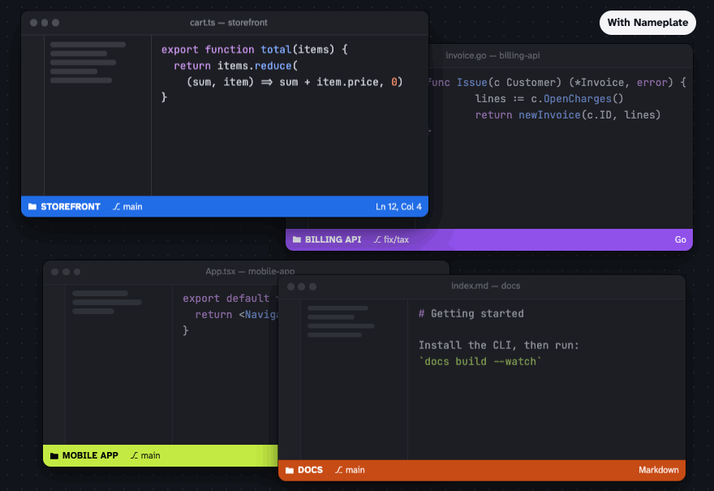
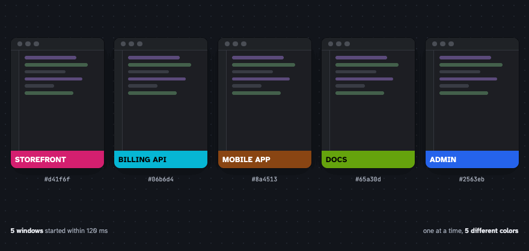
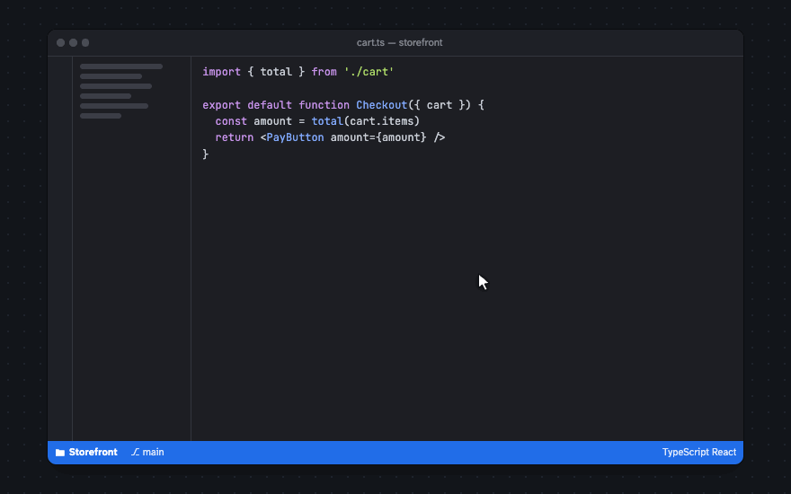
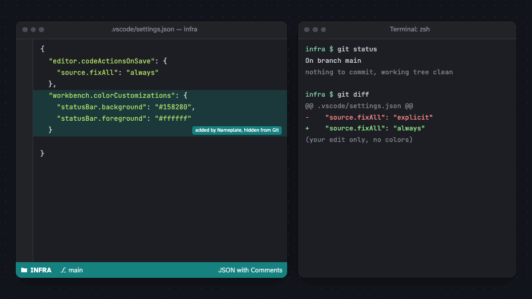

# Nameplate

[](https://github.com/rowhitswami/nameplate/actions/workflows/ci.yml)
[](LICENSE)

Nameplate shows the project's name at the left end of the VS Code status bar and gives every project a status bar color of its own.



## Why

If you keep several projects open, you have several VS Code windows that look exactly alike: same theme, same layout, same panels. After a few switches it is easy to lose track of which project is in front of you. Then a command runs in the wrong terminal, a commit goes to the wrong repository, or you spend ten minutes editing the wrong copy of a project.

The window title does name the folder, but it is small and easy to skip. A colored status bar can be recognized without reading anything, including on windows that are not focused, and the name next to it tells you what the color stands for.

## What it does

- Finds a name for each project, using the folder, the workspace file, `package.json`, Expo's `app.json`, `pyproject.toml`, `Cargo.toml`, `go.mod`, `pubspec.yaml`, `composer.json` or the Git remote.
- Colors the whole status bar. The color is derived from the Git remote, so a repository gets the same color on every machine. The text on it is white or black, whichever is easier to read.
- Keeps open windows apart. When two windows would get colors that look alike, one of them takes another color.
- Keeps the colors out of Git. VS Code reads a window's colors from `.vscode/settings.json`, and Nameplate makes sure Git never sees those lines.
- Opens a menu when you click the name, where you can rename the project, pick a color, add a label such as `PROD`, copy the path or remote, or open the repository.

There is nothing to configure. After installing, every open window shows its name and color.

| Windows opened together                                                                   | Clicking the name                                                                 |
| ----------------------------------------------------------------------------------------- | --------------------------------------------------------------------------------- |
|  |  |



## Editors

Nameplate uses only the standard extension API, so it runs in VS Code and in editors built on VS Code 1.85 or later.

| Editor                    | Made by             | Install from              |
| ------------------------- | ------------------- | ------------------------- |
| VS Code, VS Code Insiders | Microsoft           | Visual Studio Marketplace |
| Cursor                    | Anysphere           | Open VSX                  |
| Windsurf                  | Cognition           | Open VSX                  |
| Antigravity               | Google              | Open VSX                  |
| Kiro                      | Amazon Web Services | Open VSX                  |
| Positron                  | Posit               | Open VSX                  |
| VSCodium                  | VSCodium project    | Open VSX                  |
| Trae                      | ByteDance           | `.vsix` file              |

Any of them can also install the `.vsix` from the [releases page](https://github.com/rowhitswami/nameplate/releases) (Extensions view, then **Install from VSIX…**). Remote windows over SSH, WSL and Dev Containers work as well, with one exception described under [Limitations](#limitations).

## Names

The first of these that gives a meaningful name is used:

1. A name you set with **Rename Project**.
2. The `.code-workspace` file name, for saved workspaces.
3. The folder name, unless it is generic (`app`, `src`, `frontend`, `tmp.x1` and so on).
4. A product name from Expo's `app.json`, or `displayName` / `productName` from `package.json`.
5. A package name from `package.json`, `pyproject.toml`, `Cargo.toml`, `go.mod`, `pubspec.yaml` or `composer.json`.
6. The repository and folder name together, for a generically named folder inside a repository.
7. The repository name from the Git remote, then the name of the repository folder.

If another source spells the same name with mixed case, that spelling is used, so a folder called `brightdesk` with a remote called `BrightDesk` shows as **BrightDesk**. Plain lowercase names are shown in capitals with spaces between the words (`brightdesk-mobile` becomes **BRIGHTDESK MOBILE**). `nameplate.textTransform` changes this, and `nameplate.nameSource` makes another source win.

## Colors

The automatic palette has eleven colors: blue, cyan, teal, green, lime, orange, brown, pink, magenta, purple and indigo. Red and yellow are available when you pick a color yourself, but are never assigned automatically, because a red or yellow status bar looks like an error or a warning.

Each project gets a fixed order of these colors, worked out from its Git remote (or its folder, if there is no remote). It takes the first color in that order unless that color looks too much like the color of another open window. Colors are compared the way people see them (distance in the OKLab color space): teal next to green counts as too close, and blue next to indigo is avoided when another color is free. Once a project has a color it keeps it.

Windows that start at the same moment, for example right after installing, take turns through a small shared file in Nameplate's storage folder, so each one sees the colors the others picked. If two open windows ever end up looking alike, the one that got the color later switches to a free color and says so in its status bar. Colors you picked yourself never change.

With eleven colors, about nine windows can be told apart clearly. With more windows open, Nameplate picks the color that differs most from the ones already on screen.

## Keeping colors out of Git

VS Code can only color a single window through that project's workspace settings, which live in `.vscode/settings.json`. Nameplate writes three entries there (`statusBar.background`, `statusBar.foreground` and `statusBar.inactiveBackground`) and keeps them out of Git:

- If the file does not exist yet, Nameplate creates it and adds it to `.git/info/exclude`. That file is local to your clone and never committed.
- If the file is committed, Nameplate adds a small [Git clean filter](https://git-scm.com/docs/gitattributes#_filter) for it in `.git/config` and `.git/info/attributes`, which are local as well. When Git reads the file, the filter removes Nameplate's lines. `git status`, `git diff` and commits only see your own changes, and pull, checkout, stash and rebase keep working. The filter runs on the copy of Node that ships with VS Code, so there is nothing to install.
- When Nameplate stops coloring a project, it removes its lines, the exclude entry and the filter again.

To write the colors without hiding them, for example to share a color with your team, set `nameplate.keepColorsOutOfGit` to `false`.

## Your other settings

Nameplate changes only its own keys inside `workbench.colorCustomizations`. Other entries stay as they are and keep their order. Before writing a key it remembers the previous value, and turning coloring off puts that value back. If a key is already set by you or another extension (Peacock, for example), Nameplate leaves the window alone and shows the reason in the tooltip. It replaces such a value only when you choose a color yourself, and keeps a copy to restore later.

## Commands

All commands are in the Command Palette under **Nameplate**. Most are also in the menu that opens when you click the project name.

| Command                               | What it does                                                                                    |
| ------------------------------------- | ----------------------------------------------------------------------------------------------- |
| Nameplate: Show Project Actions       | Opens the project menu.                                                                         |
| Nameplate: Rename Project…            | Sets the name for this workspace. Leave it empty to go back to the automatic name.              |
| Nameplate: Change Project Color…      | Choose from the palette with a live preview, or enter a hex color. The contrast ratio is shown. |
| Nameplate: Set Environment Label…     | Adds `DEV`, `LOCAL`, `STAGING`, `PROD` or your own text after the name.                         |
| Nameplate: Reset Project Name         | Goes back to the automatic name.                                                                |
| Nameplate: Reset Project Color        | Goes back to the automatic color.                                                               |
| Nameplate: Regenerate Automatic Color | Picks the next free automatic color.                                                            |
| Nameplate: Reset Project Identity     | Forgets the name, color and label set for this workspace.                                       |
| Nameplate: Show Project Information   | Lists name, path, repository, branch, remote, colors and project type. Select a row to copy it. |
| Nameplate: Copy Project Path          | Copies the folder path.                                                                         |
| Nameplate: Copy Git Remote            | Copies the remote URL, without any credentials in it.                                           |
| Nameplate: Open Project Folder        | Shows the folder in Finder, Explorer or your file manager.                                      |
| Nameplate: Open Repository            | Opens the repository on GitHub, GitLab, Bitbucket, Azure DevOps or your own server.             |
| Nameplate: Toggle Project Coloring    | Turns coloring off or on for this workspace.                                                    |
| Nameplate: Enable / Disable           | Turns Nameplate on or off everywhere. Disabling removes its colors from the open window.        |
| Nameplate: Show Log                   | Opens Nameplate's log in the Output panel.                                                      |

## Settings

The defaults are meant to work without changes.

| Setting                              | Default   | Description                                                                       |
| ------------------------------------ | --------- | --------------------------------------------------------------------------------- |
| `nameplate.enabled`                  | `true`    | Turns Nameplate on or off.                                                        |
| `nameplate.showProjectName`          | `true`    | Shows the name in the status bar.                                                 |
| `nameplate.colorStatusBar`           | `true`    | Colors the status bar.                                                            |
| `nameplate.icon`                     | `folder`  | Icon before the name; leave empty for none.                                       |
| `nameplate.showBranch`               | `false`   | Adds the Git branch after the name. Off because VS Code already shows the branch. |
| `nameplate.textTransform`            | `auto`    | `auto`, `none`, `uppercase`, `lowercase` or `capitalize`.                         |
| `nameplate.nameSource`               | `auto`    | Which source to try first: `auto`, `folder`, `manifest` or `repository`.          |
| `nameplate.colorSource`              | `auto`    | `auto` (Git remote, then path), `path` (each clone its own color) or `name`.      |
| `nameplate.avoidColorCollisions`     | `true`    | Keeps open windows apart and avoids colors your other recent projects use.        |
| `nameplate.palette`                  | `[]`      | Your own hex colors for automatic assignment.                                     |
| `nameplate.colorWhileDebugging`      | `false`   | Keeps the project color while debugging.                                          |
| `nameplate.keepColorsOutOfGit`       | `true`    | Hides the color settings from Git with a local exclude entry or filter.           |
| `nameplate.statusBarPriority`        | `1000000` | Higher values place the name further left.                                        |
| `nameplate.showFirstRunNotification` | `true`    | Shows a short hint the first time a window is colored.                            |

## Privacy

Nameplate makes no network requests and collects no data. It reads a few files at the root of your project (`package.json` and similar, `.git/HEAD`, `.git/config`) and writes its color settings into the workspace settings. Custom names and colors are kept in VS Code's storage on your computer. To keep windows apart it keeps a small file (`registry.json` in its storage folder) with each project's identity, name and colors and the process IDs of the windows that show them. In repositories it colors it adds the local Git entries described above and `.git/nameplate-colors.json`, which tells the filter which lines are Nameplate's. Remote URLs are shown and copied without credentials.

## Limitations

- Colors have to be stored in the workspace settings, because VS Code has no other way to color a single window.
- In remote windows (SSH, WSL, containers) Git runs on the other machine, where Nameplate cannot add its filter. A settings file that is already committed then keeps the default color unless you pick a color yourself.
- Uninstalling cannot clean up projects that are not open. Run **Nameplate: Disable** in your open windows first. Anything left behind is harmless: without the extension, the filter passes files through unchanged.
- Git applications that cannot run shell scripts don't apply the filter. Git on macOS, Linux and Windows, VS Code and GitHub Desktop all run filters.
- High-contrast themes get the same colors. The text keeps a 4.5:1 contrast ratio, but not the 7:1 those themes aim for.
- VS Code rewrites the `workbench.colorCustomizations` block when it changes it, so comments inside that block are lost.

## Development

```bash
npm install
npm run check              # typecheck, lint, formatting, unit tests
npm run test:integration   # runs the extension in a downloaded copy of VS Code
npm run test:multiwindow   # opens six windows of a separate VS Code and checks their colors
npm run package            # builds nameplate-<version>.vsix
npm run media              # rebuilds docs/index.html and the GIFs above (needs Chrome)
```

Press <kbd>F5</kbd> in VS Code to start an Extension Development Host. The code is split into a part without VS Code dependencies (`src/core`, covered by unit tests) and the code that talks to VS Code. [docs/ARCHITECTURE.md](docs/ARCHITECTURE.md) explains how the parts fit together.

To install a local build:

```bash
code --install-extension nameplate-0.2.0.vsix
```

## Contributing

Issues and pull requests are welcome. Please read [CONTRIBUTING.md](CONTRIBUTING.md) first, in particular the note about the automatic palette, whose order must not change.

## Roadmap

- Show the custom name in the window title.
- Optionally color the title bar or activity bar as well.
- A project switcher that lists recent projects with their colors.
- `NAMEPLATE_PROJECT` and `NAMEPLATE_COLOR` variables for terminal prompts.
- Team colors stored in committed settings, for projects that want them.

## License

[MIT](LICENSE)
